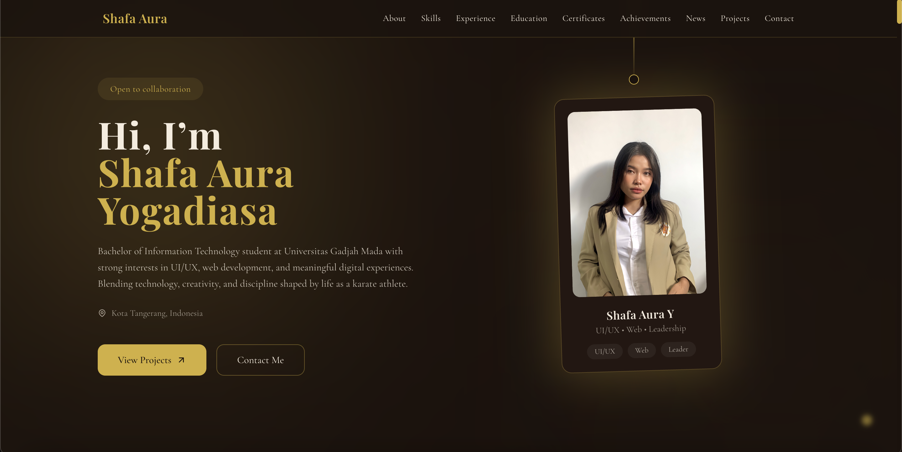

# ✨ Shafa Aura Yogadiasa — Personal Portfolio Website

A modern and responsive personal portfolio website built with **React.js**, **Vite**, **TailwindCSS**, and **Framer Motion** to showcase my experiences, projects, leadership journey, achievements, and technical skills in Information Technology.

This portfolio is designed with a premium modern aesthetic, smooth animations, elegant UI/UX, and fully responsive layouts across all devices.

---

# 🌐 Live Website

🚀 Live Demo:  
https://portfolio-shafa.vercel.app/

📂 GitHub Repository:  
https://github.com/shafaauray/portfolio-shafa

---

# 📸 Website Preview



---

# 👩🏻‍💻 About Me

Hi! I'm **Shafa Aura Yogadiasa**, an Information Engineering student at Universitas Gadjah Mada who is passionate about combining technology, creativity, leadership, and innovation.

I have strong interests in:
- UI/UX Design
- Software Development
- AI-based Systems
- Data & Technology
- Creative Digital Media

Besides technology, I am also actively involved in organizations, event management, and national/international karate championships.

This portfolio serves as a digital representation of my academic journey, technical projects, organizational experiences, and achievements.

---

# 🛠️ Tech Stack

## Frontend
- React.js
- Vite
- Tailwind CSS
- Framer Motion

## UI & Animation
- Responsive Design
- Modern Glassmorphism UI
- Smooth Scroll Animation
- Hover Interaction Effects
- Interactive Project Slider
- Motion-based Transitions

## Deployment
- Vercel

---

# ✨ Features

## 🎨 Modern Responsive Design
Designed to look elegant and professional across:
- Desktop
- Tablet
- Mobile Devices

---

## 🚀 Smooth Animations
Implemented using Framer Motion:
- Fade Animations
- Slide Transitions
- Hover Interactions
- Motion-based Section Reveal
- Interactive Card Effects

---

## 👩🏻‍💻 Dynamic Project Showcase
Each project includes:
- Interactive Image Slider
- Video Preview Support
- Tech Stack Information
- Live Project Links
- GitHub Repository Links

---

## 📚 Experience & Organization Timeline
Displays:
- Work Experiences
- Organizational Experiences
- Event Committees
- Leadership Roles
- Activity Documentation

---

## 🏆 Achievements Section
Showcasing:
- National Karate Achievements
- International Karate Achievements
- Academic & Non-Academic Awards

---

## 📩 Functional Contact Form
Integrated with Formspree for:
- Real Email Delivery
- User Message Handling
- Professional Communication

---

# 📂 Project Structure

```bash
src/
│
├── components/
│   ├── Navbar.jsx
│   ├── Footer.jsx
│   ├── SocialButton.jsx
│
├── sections/
│   ├── Hero.jsx
│   ├── About.jsx
│   ├── Education.jsx
│   ├── Experience.jsx
│   ├── Organization.jsx
│   ├── Projects.jsx
│   ├── Achievements.jsx
│   ├── Contact.jsx
│
├── assets/
│
├── App.jsx
├── main.jsx
│
public/
│   ├── project images
│   ├── project videos
│   ├── documentation photos
│   ├── CV PDF
│   ├── ssweb.jpeg